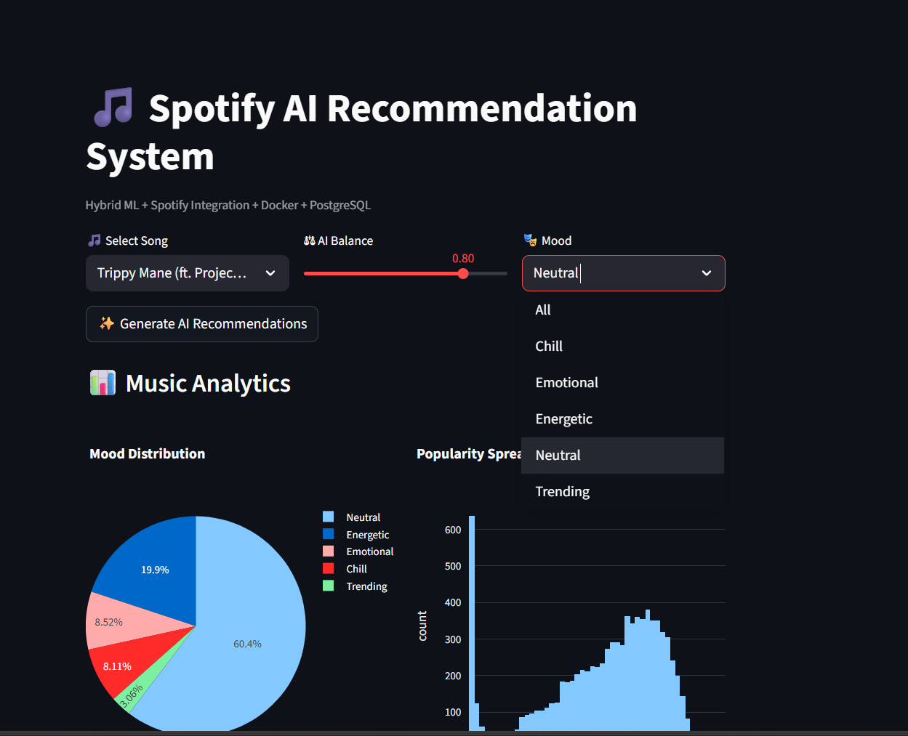
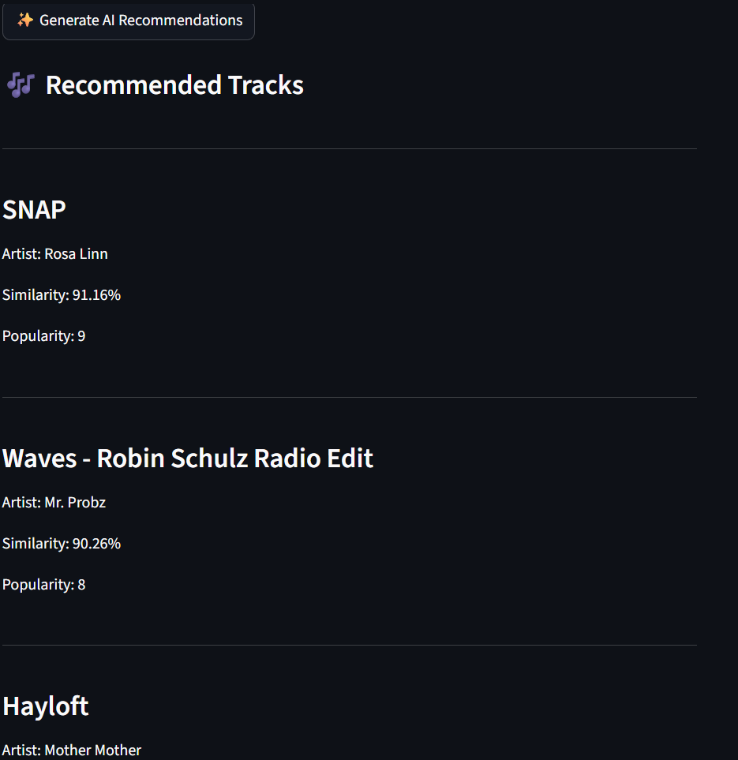
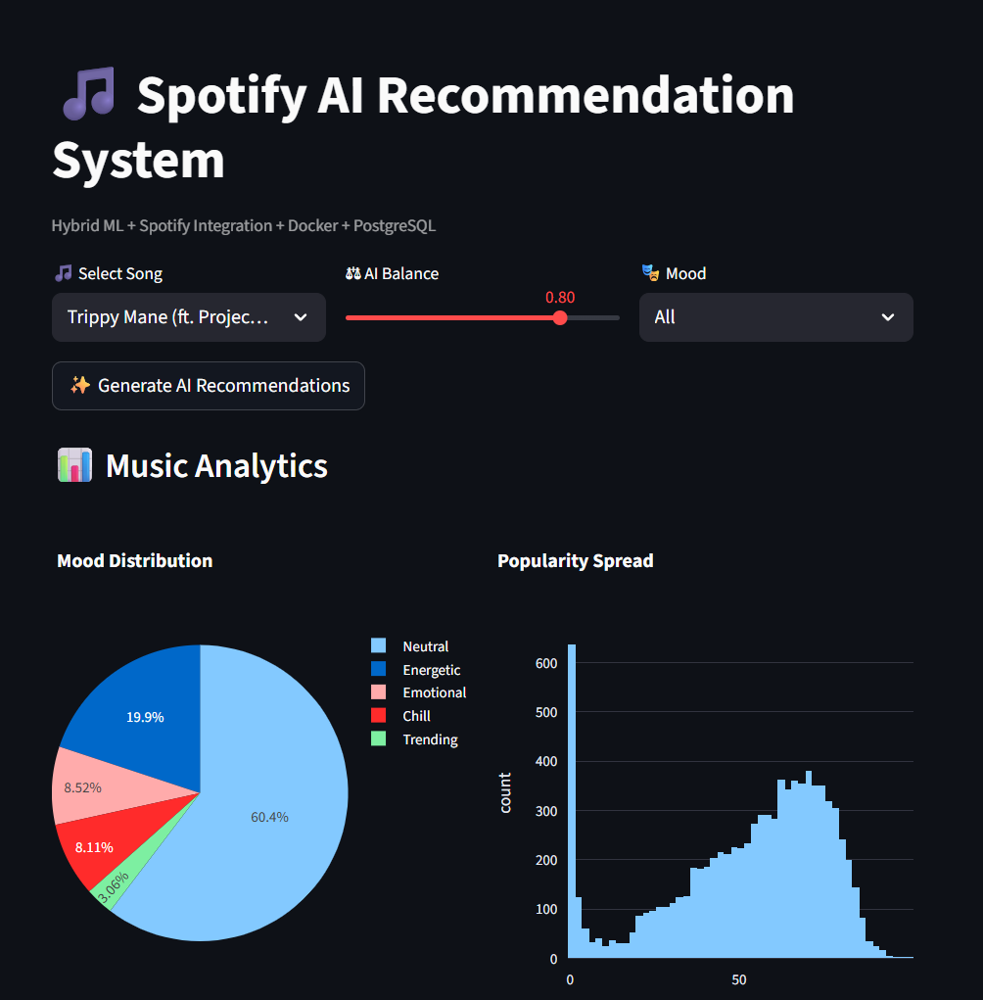

# 🎵 Spotify AI Recommendation System

  

  <b>Hybrid Machine Learning + Spotify API + PostgreSQL + Docker</b>

---

## 📌 Overview

This project is a production-ready hybrid music recommendation engine built using content-based filtering with cosine similarity, enhanced by popularity blending and real-time Spotify API integration.

The system provides:

- 🎧 Intelligent song recommendations
- 🎵 Spotify album cover + audio preview
- 📊 Real-time analytics dashboard
- 🗄 PostgreSQL logging of recommendation history
- 🐳 Full Docker multi-container deployment

## 🏗 Architecture

User
  ↓
Streamlit App (Docker Container)
  ↓
ML Recommendation Engine
  ↓
Spotify Web API
  ↓
PostgreSQL (Docker Container)

## 🎧 Application Interface

### 🏠 Homepage

  

---

### 🤖 AI Recommendations

  

---

### 📊 Analytics Dashboard

  

-- Installation:

## 🛠 Local Setup
git clone https://github.com/yourusername/spotify-ai-recommendation-system.git
cd spotify-ai-recommendation-system
pip install -r requirements.txt
streamlit run app/app.py

## 🐳 Docker Deployment
docker-compose up --build
http://localhost:8501

## 🔐 Environment Variables
SPOTIFY_CLIENT_ID=your_id
SPOTIFY_CLIENT_SECRET=your_secret

## 🗄 Database Logging
docker exec -it spotify_db psql -U postgres
\c spotifydb
SELECT * FROM recommendation_logs;

## 🧠 ML Strategy
Similarity Score = Cosine Similarity (TF-IDF features)

Final Ranking Score =
α * Similarity + (1 - α) * Popularity Score

## 🧪 Tech Stack

Python

Streamlit

Scikit-learn

Spotipy

SQLAlchemy

PostgreSQL

Docker

Docker Compose

Plotly

## 🚀 Future Improvements

Collaborative filtering

Matrix factorization

Neural embeddings

User authentication

FastAPI backend

CI/CD pipeline

## 📑 Table of Contents
- Overview
- Architecture
- Features
- Demo
- Installation
- Docker Deployment
- Environment Variables
- ML Strategy
- Tech Stack
- Future Improvements